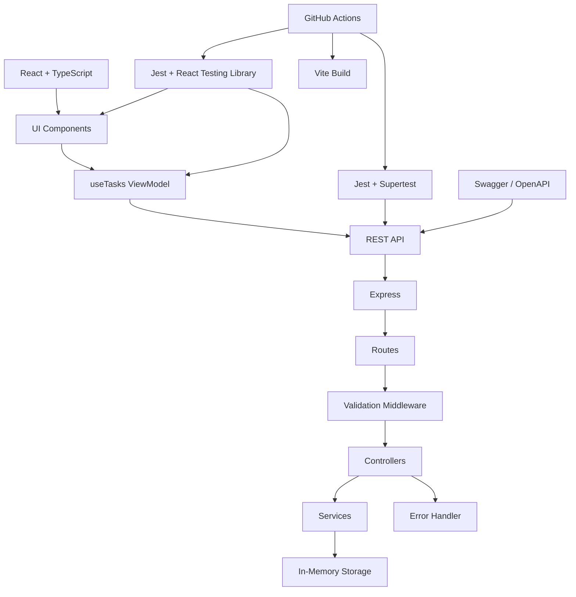

# TaskFlow 🚀


A full-stack task management and productivity application built with **React, TypeScript, Node.js, and Express**.

TaskFlow started as a simple Todo List designed to practice automated testing with **Jest, React Testing Library, and Supertest**. The project was progressively extended into a richer task management platform with task organization, filtering, sorting, productivity statistics, responsive design, Swagger API documentation, layered backend architecture, and continuous integration.

---

## 📌 Project Overview

TaskFlow allows users to create, organize, update, complete, and delete tasks through a modern responsive web interface.

### Current Features

* Create tasks
* Display tasks
* Edit tasks
* Complete / reactivate tasks
* Delete tasks
* Delete confirmation
* Task validation
* Priorities
* Due dates
* Categories
* Search
* Status filtering
* Category filtering
* Sorting
* Productivity statistics
* Completion rate
* Loading state
* Error state
* Retry mechanism
* Empty states
* Success notifications
* Dark mode
* Responsive design
* REST API
* Swagger / OpenAPI documentation
* Automated frontend and backend testing
* GitHub Actions CI

---

## 🛠️ Tech Stack

### Frontend

* React 19
* TypeScript
* Vite
* Material UI (MUI)

### Backend

* Node.js
* Express 5
* CORS
* dotenv

### Testing

* Jest
* React Testing Library
* Jest DOM
* Supertest
* ts-jest

### API Documentation

* OpenAPI 3.0
* Swagger UI Express
* Swagger JSDoc

### CI

* GitHub Actions

---

## 🏗️ Architecture

TaskFlow uses a separated frontend/backend architecture.

### Frontend Architecture

```text
React Application
       │
       ▼
UI Components
       │
       ▼
useTasks ViewModel
       │
       ▼
REST API
```

### Backend Architecture

```text
HTTP Request
      │
      ▼
    Routes
      │
      ▼
Validation Middleware
      │
      ▼
  Controllers
      │
      ▼
   Services
      │
      ▼
In-Memory Storage
      │
      ▼
 HTTP Response
```

### Complete Architecture



---

## 📂 Project Structure

```text
todo-app/
│
├── .github/
│   └── workflows/
│       └── ci.yml
│
├── public/
│
├── src/
│   ├── components/
│   │   ├── DashboardStats.tsx
│   │   ├── DashboardStats.test.tsx
│   │   ├── TaskForm.tsx
│   │   ├── TaskForm.test.tsx
│   │   ├── TaskItem.tsx
│   │   ├── TaskItem.test.tsx
│   │   ├── TaskList.tsx
│   │   └── TaskList.test.tsx
│   │
│   ├── utils/
│   │   ├── validateTask.ts
│   │   └── validateTask.test.ts
│   │
│   ├── viewmodels/
│   │   ├── useTasks.ts
│   │   └── useTasks.test.ts
│   │
│   ├── App.tsx
│   ├── App.test.tsx
│   └── App.css
│
├── server/
│   ├── controllers/
│   │   └── tasksController.js
│   │
│   ├── middleware/
│   │   ├── errorHandler.js
│   │   └── validateTask.js
│   │
│   ├── routes/
│   │   ├── tasks.js
│   │   └── tasks.test.js
│   │
│   ├── services/
│   │   ├── taskService.js
│   │   └── swagger.test.js
│   │
│   ├── swagger.js
│   ├── app.js
│   ├── server.cjs
│   └── setupTests.js
│
├── package.json
├── vite.config.ts
├── babel.config.cjs
└── README.md
```

---

## ✨ Features

### Task Management

Users can:

* Create a task
* Edit an existing task
* Mark a task as completed
* Reactivate a completed task
* Delete a task
* Confirm deletion before removing a task

Each task can contain:

* Task text
* Completion status
* Priority
* Category
* Due date

---

### 🔴 Priorities

Tasks support three priority levels:

* 🔴 High
* 🟠 Medium
* 🟢 Low

Tasks can be sorted by priority.

---

### 🏷️ Categories

Supported categories:

* 🎓 University
* 💼 Work
* 👤 Personal
* 🛒 Shopping
* 📌 Other

Tasks can be filtered by category.

---

### 📅 Due Dates

Tasks can have a due date.

The application identifies overdue active tasks and includes them in the dashboard statistics.

---

### 🔎 Search

Users can search tasks by text.

Example:

```text
Search: React
```

Search can be combined with:

* Status filters
* Category filters
* Sorting

---

### 🔍 Filtering

#### Status

* All Tasks
* Active
* Completed
* Overdue

#### Category

* All
* University
* Work
* Personal
* Shopping
* Other

Filters can be combined with search.

---

### ↕️ Sorting

Available options:

* Default order
* Priority: High → Low
* Priority: Low → High
* Due date
* Alphabetical A → Z

---

## 📊 Productivity Dashboard

TaskFlow includes dynamically calculated productivity statistics.

### Main Statistics

* Total tasks
* Active tasks
* Completed tasks
* Overdue tasks

### Completion Rate

The application calculates:

```text
Completed Tasks / Total Tasks × 100
```

### Tasks by Priority

The dashboard displays:

* High
* Medium
* Low

### Tasks by Category

The dashboard displays:

* University
* Work
* Personal
* Shopping
* Other

---

## 🎨 User Experience

### Loading State

While tasks are being retrieved:

```text
Loading tasks...
```

### Error State

If the API cannot be reached:

```text
Unable to load tasks. Please try again.
```

The user can retry without refreshing the page.

### Empty State

When no tasks exist:

```text
📝 No tasks yet. Create your first task!
```

When search or filters return no result:

```text
🔍 No matching tasks.
Try changing your search or filters.
```

### Notifications

Successful operations display notifications such as:

```text
Task added successfully
Task updated successfully
Task completed
Task deleted successfully
```

### Delete Confirmation

Deleting a task requires explicit confirmation before removal.

### Dark Mode

The interface supports light and dark themes.

### Responsive Design

The UI adapts to:

* Desktop
* Tablet
* Mobile

---

## 🔌 REST API

The backend exposes a REST API for task management.

| Method | Endpoint     | Description        |
| ------ | ------------ | ------------------ |
| GET    | `/tasks`     | Retrieve all tasks |
| POST   | `/tasks`     | Create a task      |
| PUT    | `/tasks/:id` | Update a task      |
| PATCH  | `/tasks/:id` | Toggle completion  |
| DELETE | `/tasks/:id` | Delete a task      |

### GET `/tasks`

Retrieves all tasks.

Example response:

```json
[
  {
    "id": 1,
    "text": "Learn React",
    "completed": false,
    "dueDate": "2026-09-15",
    "priority": "medium",
    "category": "University"
  }
]
```

### POST `/tasks`

Creates a new task.

Example request:

```json
{
  "text": "Learn React",
  "dueDate": "2026-09-15",
  "priority": "medium",
  "category": "University"
}
```

Possible responses:

```text
201 Created
400 Bad Request
```

### PUT `/tasks/:id`

Updates an existing task.

Example request:

```json
{
  "text": "Learn TypeScript",
  "dueDate": "2026-09-20",
  "priority": "high",
  "category": "University"
}
```

Possible responses:

```text
200 OK
400 Bad Request
404 Not Found
```

### PATCH `/tasks/:id`

Toggles the completion state of a task.

Possible responses:

```text
200 OK
404 Not Found
```

### DELETE `/tasks/:id`

Deletes a task.

Possible responses:

```text
204 No Content
404 Not Found
```

---

## 📖 Swagger / OpenAPI

TaskFlow provides interactive API documentation through Swagger UI.

Start the backend:

```bash
node server/server.cjs
```

Then open:

```text
http://localhost:3000/api-docs/
```

The documented endpoints are:

```text
GET    /tasks
POST   /tasks
PUT    /tasks/{id}
PATCH  /tasks/{id}
DELETE /tasks/{id}
```

The API documentation follows the **OpenAPI 3.0** specification.

---

## 🧪 Testing

Testing is a central part of TaskFlow.

### Frontend Tests

The frontend suite covers:

* Components
* Form interactions
* Validation
* Task operations
* Search
* Filtering
* Sorting
* Dashboard statistics
* Loading state
* Error state
* Empty state
* Delete confirmation
* Success notifications

### Backend Tests

The backend suite covers:

* `GET /tasks`
* `POST /tasks`
* `PUT /tasks/:id`
* `PATCH /tasks/:id`
* `DELETE /tasks/:id`
* Validation
* Error responses
* Swagger documentation

### Run Tests

```bash
npm test
```

Current verified result:

```text
Test Suites: 9 passed, 9 total
Tests:       72 passed, 72 total
```

### Run Tests with Coverage

```bash
npm run test:coverage
```

---

## 📈 Test Coverage

Current verified coverage:

| Metric     | Result |
| ---------- | -----: |
| Statements | 88.42% |
| Branches   | 69.73% |
| Functions  | 78.16% |
| Lines      | 88.35% |

Jest generates the coverage report in:

```text
coverage/
```

---

## 🔄 Continuous Integration

TaskFlow uses **GitHub Actions** to automatically validate changes.

The CI pipeline performs:

```text
Push / Pull Request
        ↓
Checkout repository
        ↓
Setup Node.js 24
        ↓
Install dependencies
        ↓
Run Jest tests
        ↓
Build application
```

The workflow is defined in:

```text
.github/workflows/ci.yml
```

Current CI workflow status:

```text
✅ Dependencies installed
✅ Tests passed
✅ Production build passed
```

---

## 🏗️ Backend Engineering

The backend is separated into multiple layers.

### Routes

Responsible for defining API endpoints.

```text
server/routes/
```

### Middleware

Responsible for:

* Request validation
* Centralized error handling

```text
server/middleware/
```

### Controllers

Responsible for handling HTTP requests and responses.

```text
server/controllers/
```

### Services

Responsible for task-related business logic.

```text
server/services/
```

This separation improves:

* Maintainability
* Readability
* Testability
* Separation of concerns

---

## 💾 Data Storage

The current version uses an in-memory array on the backend.

This was intentionally chosen during the training phase to keep the focus on:

* React development
* REST API development
* Express architecture
* Automated testing
* Software design

Because the data is stored in memory, tasks are reset when the backend server restarts.

---

## 🚀 Getting Started

### 1. Install dependencies

```bash
npm install
```

### 2. Start the frontend

```bash
npm run dev
```

Frontend:

```text
http://localhost:5173
```

### 3. Start the backend

Open another terminal:

```bash
node server/server.cjs
```

Backend:

```text
http://localhost:3000
```

### 4. Open Swagger

```text
http://localhost:3000/api-docs/
```

---

## 📜 Available Scripts

### Development

```bash
npm run dev
```

### Production Build

```bash
npm run build
```

### Run Tests

```bash
npm test
```

### Test Coverage

```bash
npm run test:coverage
```

### Lint

```bash
npm run lint
```

### Preview Production Build

```bash
npm run preview
```

---

## 🧠 Testing Strategy

The project follows a layered testing approach:

```text
Utility Tests
      ↓
Component Tests
      ↓
ViewModel / Logic Tests
      ↓
API Integration Tests
      ↓
Swagger Tests
      ↓
CI Validation
```

The goal is to continuously verify application behavior while adding new features and refactoring the codebase.

---

## 🎓 Project Purpose

TaskFlow was initially created as an internship-training project to practice automated testing before applying the same methodology to production-oriented modules.

The project provides practical experience in:

* React
* TypeScript
* REST API development
* Express
* Component testing
* API testing
* Validation
* Error handling
* Software architecture
* Continuous integration

---

## 👩‍💻 Development Approach

The application was developed progressively.

For each feature, the development process followed:

```text
Requirement
     ↓
Implementation
     ↓
Testing
     ↓
Refactoring
     ↓
Build Verification
```

This approach allowed the original Todo List to evolve into a more complete task-management application while continuously preserving existing functionality.

---

## 🔮 Future Improvements

Possible future versions may introduce:

* User authentication
* JWT authorization
* Database persistence
* User accounts
* Calendar view
* Custom categories
* Task reminders
* Advanced productivity analytics
* End-to-end testing
* Deployment improvements

---

## ✅ Current Project Status

| Area                | Status |
| ------------------- | ------ |
| Frontend            | ✅      |
| Backend             | ✅      |
| CRUD                | ✅      |
| Validation          | ✅      |
| Priorities          | ✅      |
| Due dates           | ✅      |
| Categories          | ✅      |
| Search              | ✅      |
| Filtering           | ✅      |
| Sorting             | ✅      |
| Dashboard           | ✅      |
| Loading state       | ✅      |
| Error state         | ✅      |
| Retry               | ✅      |
| Empty state         | ✅      |
| Delete confirmation | ✅      |
| Toast notifications | ✅      |
| Dark mode           | ✅      |
| Responsive design   | ✅      |
| Backend layering    | ✅      |
| Swagger / OpenAPI   | ✅      |
| Automated tests     | ✅      |
| GitHub Actions CI   | ✅      |
| Production build    | ✅      |

---

## 🌐 Repository

GitHub:

https://github.com/saddemmaram-alt/Todo-app

Live application:

https://todo-app-gold-three-78.vercel.app/